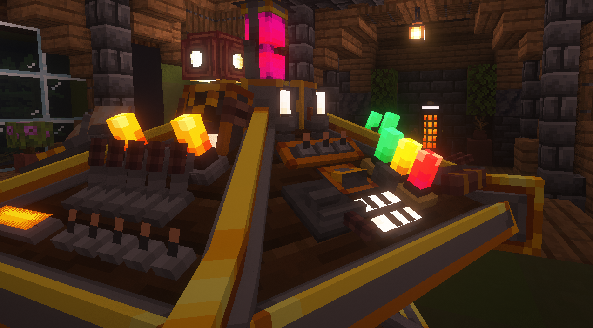
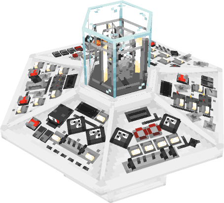

The TARDIS console is the main control unit of the TARDIS, which can be interacted with by a player or another entity. The TARDIS should always be piloted by 6 fully-trained TARDIS pilots as to allow for a smooth journey.

Out-of-universe, the console is a collection of **Control Entities** which are located around the console block that do different functions.

## How do I create a console?

To create a console, craft a **Console Generator**. You are provided with one Console Generator when you configure a new desktop. Using a Console Generator is the only way to create a console. 

Here is the crafting recipe for a Console Generator:

Place the Console Generator in the TARDIS interior to select any of the unlocked consoles that exist.

To use the Console Generator, follow this easy guide:
1. Right-click on the Console Generator to change the **type** of console.
2. Right-click *while crouching* on the Console Generator to change the **variant**.
3. Confirm the console by using a linked [**Sonic Screwdriver**](../../items/sonic).

## How do I use a TARDIS Console?
If you're having a hard time finding the controls, you can use the [**Scanning Mode**](../../items/sonic#scanning-mode) of a [**Sonic Screwdriver**](../../items/sonic). Alternatively, you're able to turn on debugging mode for viewing entity **hitboxes**, using F3+B which will toggle the debug **hitbox** mode.

Right or left click on any of the controls to activate them. Certain controls - like the **throttle** - need you to crouch to increment them fully up or fully down but will do normal increments while freestanding.

The **Increment Control** is a special control, however; it goes from 1-10-100-1000, and you can also crouch to decrease down instead of increasing up the scale.

The **Coordinate System** (X, Y and Z) require you to right-click to decrease the increment from the current position and require you to left-click to increase the increment from the current position. 

The **Dimension Control** will change the destination dimension from one dimension to another. Right-click the control to change the dimension.

The **Exterior Facing Control** will change which direction exterior faces next time you land ranging from North, East, South and West. Right-click the control to change the facing clockwise.

The **Fast Return Control** will set the destination coordinates to the last location the TARDIS landed. Right-click the Fast Return control to activate fast return, click it again to set the destination to your current location.

The [**Protocol Controls**](../../mechanics/tardis/protocals) are explained in this webpage.

The **Anti-Gravity Control** will make the TARDIS exterior immune to falling, but uses [**Artron Energy**](../../mechanics/artron) while activating.

The [**Waypoint Controls**](../../items/sonic) are better explained in this webpage.

The **Power Control** switches the TARDIS engines off and turns the power off, rendering most of the console non-functional. If activated while other controls are activated it will disable those controls.

The **Alarm Control** switches the TARDIS alarms from active to inactive.

The **Door Control** opens the TARDIS exterior doors when right-clicked.

The **Door Lock** locks the TARDIS exterior doors, rendering them inoperable until unlocked either using a TARDIS key or using the door lock control once again.

The [**Monitor Control**](../monitor) is explained more in this webpage.

The **Refuel Control** requires the handbrake to be engaged. The refuel control will take in [**Artron Energy**](../../mechanics/artron) slowly when not in a [**Rift Chunk**](../../mechanics/rift-chunks), if it is in a rift chunk then it increases refuel speed.

The **Land Type Control** sets the TARDIS to try and land on the **surface** while enabled or land at the specific **destination coordinates** while disabled.

The **Randomiser Control** does exactly what is says on the tin. This control randomises the destination coordinates depending on how high the **increment control** is set.

The **Shield Control** has 2 functional modes, being visible shields and invisible shields, find more information in the mechanics section.


  Controls can be hit by mobs, explosions and projectiles, It can also emit redstone.

