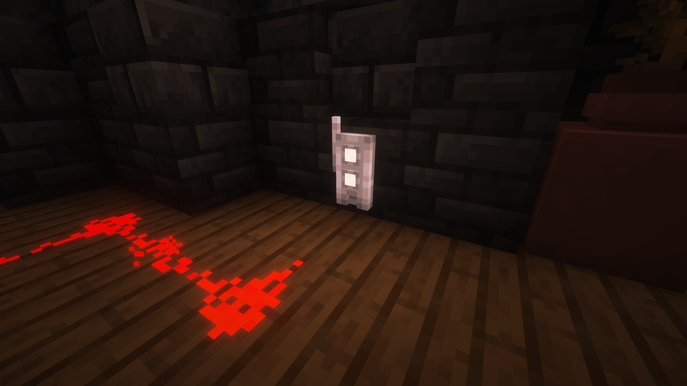
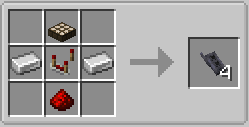

The Detector Block is used for emiting redstone once it meets a specific condition it's been set to and it can only work if it is in The TARDIS.

## How do I craft The Detector Block

## How do I use The Detector Block

The Detector Block have 7 Modes:
- **Orange** (If The TARDIS Power is on)
- **Green** (If The TARDIS is crashed)
- **Gray** (If The TARDIS is locked)
- **White** (If The TARDIS Doors are open)
- **Blue** (If theres a Sonic inserted in the Sonic Port)
- **Red** (If The TARDIS alarm is activated)
- **Purple** (If The TARDIS is in flight)

**The Detector Block** has 2 lights. one on the top and one on the bottom the light on the top indicates the mode its been set to while the light on the bottom indicates if this condtion has been met.

Right clicking on the block will make it change modes. and when the condition of the mode been met then it can emit redstone.

You can place the detector onto every block sides (north, east, south, west, up and down).