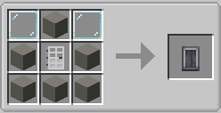
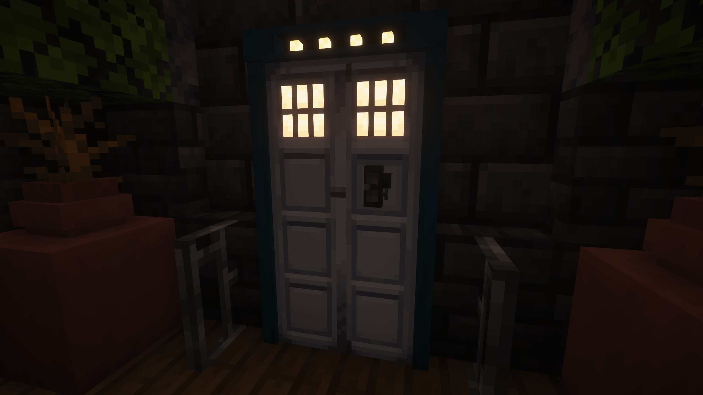

The TARDIS Interior Door is an important block in The TARDIS with also the [TARDIS Console](../console), which can be interacted with by a player. You'll need this to exit your TARDIS and make it Secure.

## How do I create a Interior Door?
Unlike the [TARDIS Console](../console) you can craft this with a crafting recipes and move it normally with breaking it with a tool as breaking it with a hand won't drop the item.

## How do I use the Interior Door?
If you right click on the **Interior Door** when it's closed then it'll open the left door and if you click it again will open the right door too clicking on it one more time will close both door. 
If you shift click the door when it's closed both doors will open.

Clicking the **Interior Door** with a **Linked Key (any type)** will lock the TARDIS and close the **TARDIS Door** (if it was open) clicking it again would unlock it.

If you have the **Gold, Netherite & Classic Key** Snapping your fingers (The Default Keybind is "**V**") will open the **TARDIS Door**

Opening the **Interior Door** while in flight would cause most entitys (including players) inside the **TARDIS Interior** will be sucked towards the door and would be located at the previous TARDIS Location.

When your in flight you can hear when you are near the **Interior Door** the sound of the vortex and when landed if theres lava infront of The TARDIS then you can hear bubbling noises from the lava and even water! You can also hear the weather outside too.


  The Interior door cannot emit redstone but the TARDIS Exterior can.
