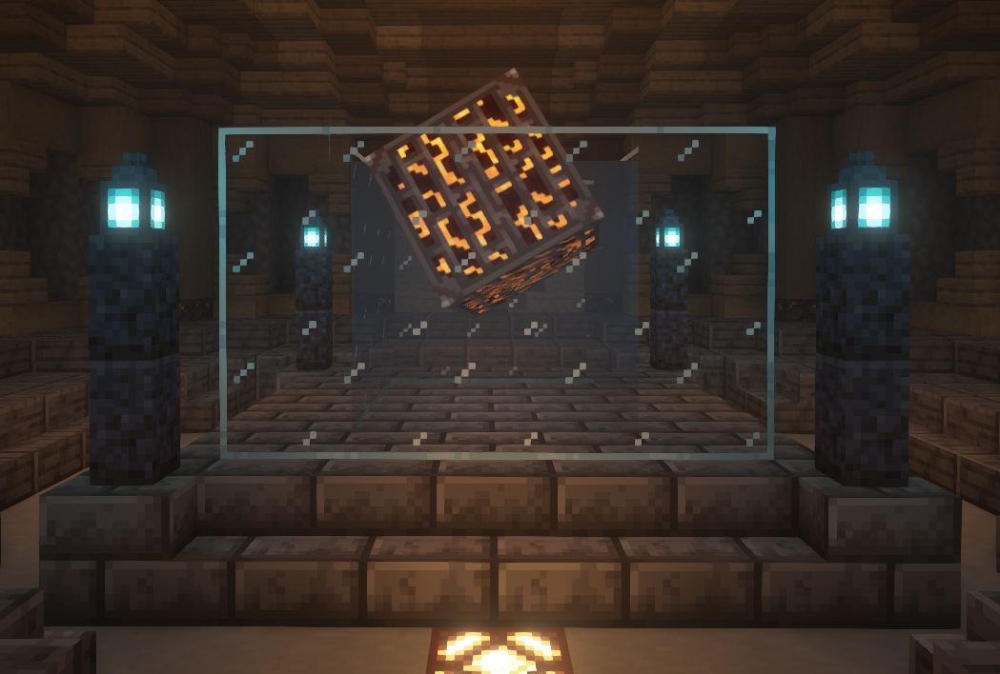
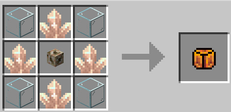

The Engine Core is the main "heart" of The TARDIS used to power your whole TARDIS.

## How do I get the Engine Core?

## How to activate the core?
You can activate the Engine Core by placing it in the middle of a 3x3x3 water area like how you would activate a conduit. This will activate the Engine Core allowing **The TARDIS** to recive power from the [TARDIS Star](../../mechanics/star.md), which will spawn under **The TARDIS Interior**
