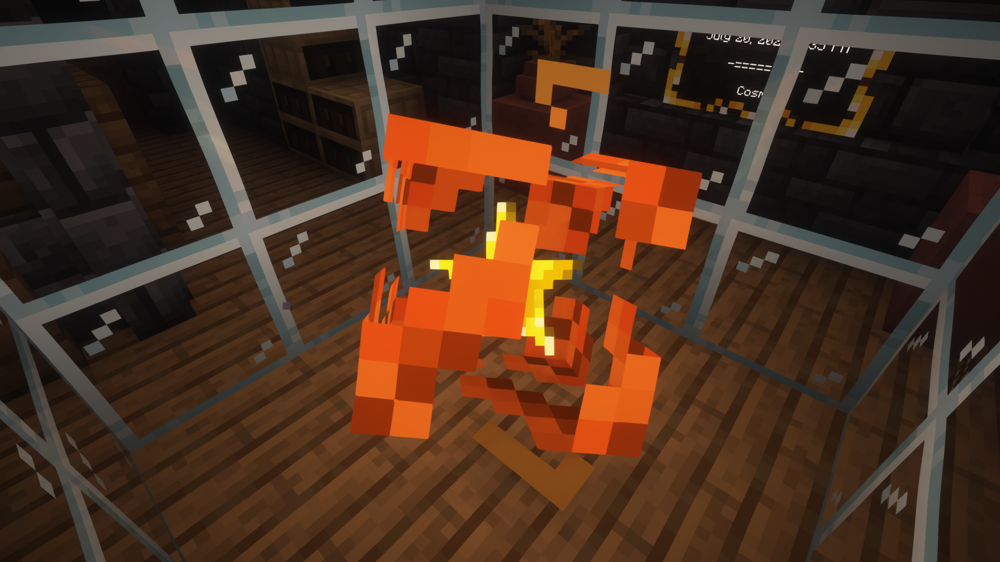

The Engine Core is the main heart of The TARDIS used to power your whole TARDIS making it alive

## How do I create a Engine Core?

u can't IMAGINE LOL 

## What can I do with a Engine Core?
You can activate the Engine Core by placing it in the middle of a 3x3 water area. This will open the Core revealing a star. The Engine Core is required for **The TARDIS** to work.


  Controls can be hit by mobs, explosions and projectiles, It can also emit redstone.
