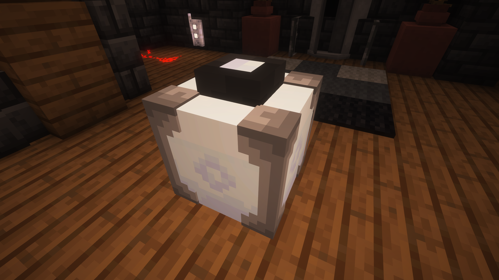
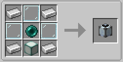

The TARDIS enviroment projector is a fun way to change the TARDIS Interior skybox, perfect for your glass roofed interior or your flashy windows full of dazzling curtians

This block can display the skybox from any dimensions (it even can work from other mods too! as long as they set it up right...)

## How do I craft a Enviroment Projector?

## How do I use the Enviroment Projector?

Interacting with the block will activate the Enviroment Projector and interacting with it again will disable it and while sneaking and interacting with the Enviroment Projector will let you scroll through the available dimensions. This block can only work in the TARDIS and will only display the skybox for that specific **TARDIS interior**.


  This block can be activated and deactivated by redstone.
