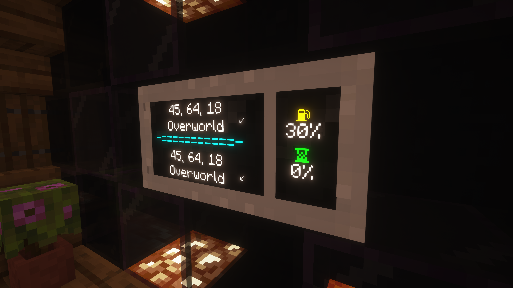
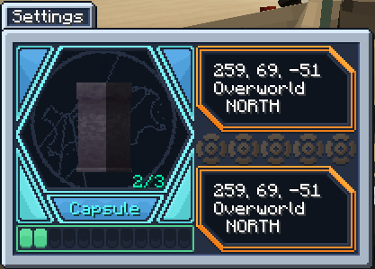
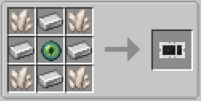
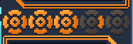
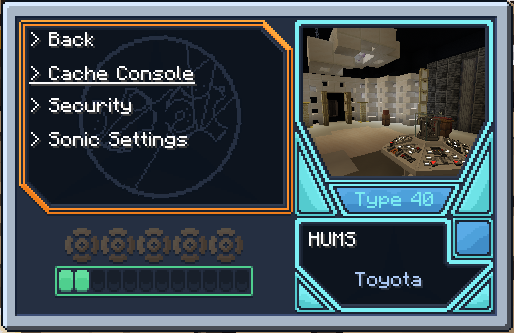

The **Wall Monitor** is another way to change settings, customise your TARDIS and viewing TARDIS info... BUT ON YOUR WALL and giving you those groovy classic vibes!
The TARDIS Menu is included with the [**TARDIS Console**](../console) and the [Monitor](../monitor) but you can craft it as a block and can use it on your wall in your interior then just your [**Console**](../console) or [Monitor](../monitor).

## Recipe

## Customizing your TARDIS
In the monitor you can customise your TARDIS like the Exterior, Interior and the Hum. For how to change it is said in [**Customizing your TARDIS**](../../mechanics/customizing) page.

## TARDIS Information
When looking at the right side of the monitor it will display a few things, on the top will display where your **TARDIS** is with the coordinates, dimension and where it's facing too. Next in the middle will display how long your flight is with a progress bar. Then on the bottom will display where is your target destination will be like the **coordinates display** and also on the bottom left is the [**Artron Energy**](../../mechanics/artron) bar that shows how much energy you have in your **TARDIS**.

## TARDIS Settings Customisation
In the menu on the top will say **Settings** click onto it and it will preview some options for you to choose, **Cache Console** removes your [**TARDIS Console**](../console) for a **Console Generator** for you to change what console it is. 

**Security** lets you choose what **Security Options** you want and is talked about in this [**TARDIS Security**](../../tardis/security) page. 

Finally the **Sonic Options** is able for you to display your **Sonic Data** and change your **Sonic Shell** and is talked about in [**Sonic**](../../items/sonic) page. 

