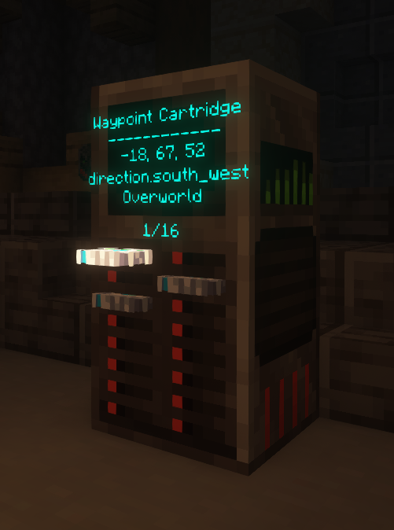

The Waypoint Bank is a easy way to fix your storage issues with waypoint cartriges, just put them in and remotly activate them from anywhere in **The TARDIS**!

## Recipe

## How do I use the Waypoint Bank?

The Waypoint Bank has 16 slots which you can insert a [Waypoint Cartrage](../../items/) into by interacting with one of the slots(Normally by right clicking it). If you **sneak** and **Interact** it.

* Get your waypoint cartridge and then simply right click
* Shift right click to pull half of it out
* Shift right click again to activate the waypoint changing the destination
* Right click when its halfway out to pull it fully out
* Left click to push it back in if its halfway out.
