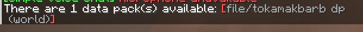


  You need to learn how texture pack and datapacks works!


When making your own AIT Datapack you may go though some minor problems on the way

### Common mistakes that people would make

## Datapack not enabled

Once in a while if you don't see your TARDIS in the [TARDIS Monitor](../../blocks/monitor) when you are selecting a **Exterior / Console Skin** or a **Interior** then it could be that the datapack is not enabled in your world. to fix this:

1. In chat run the command ```/datapack list available```

If you have this problem you may get this responce:


If you see your datapack this might be your problem and continue otherwise if you don't see this then move onto the next mistake people might make.

2. In chat run the command ```/datapack enable "file/<your datapack here>"```

After this your datapack should now work if it still doesn't work try to reload your world.

## Not Reloading Datapack

When you make changes to your datapack
