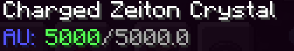

## What is this?

Charged zeiton is a alternative to the nether star when getting your TARDIS,as it turns out killing a wither can often be a nuisance,though with a little trick your able to replicate the energy of a nether star without having to actually kill a wither,this is where the fully grown zeiton crystal comes in.

## Why cant i just use normal zeiton?

Normal zeiton hasent been modified to actually be able to hold up the required amount of artron units.

## Well how do i get charged zeiton then?

## Why does it say 0/5000 AU?
The zeiton crystal can hold up to 5000 artron units,which is the required amount for a TARDIS coral to reform its interior for usage,to actually charge it use the artron collector in a rift chunk and harvest the artron units from it.

