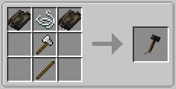

The Hammer can be used for speeding the TARDIS up when your in flight while also being a great item for bonking people (:<

## Stats
When you put the Hammer in your main hand:
- 6 Attack Damage
- 1.6 Attack Speed
(Same as a Iron Sword)

## Enchantibility
The Hammer can be enchanted with:
- [Sharpness](https://minecraft.wiki/wiki/Sharpness)
- [Smite](https://minecraft.wiki/wiki/Smite)
- [Bane of Arthropods](https://minecraft.wiki/wiki/Bane_of_Arthropods)
- [Knockback](https://minecraft.wiki/wiki/Knockback)
- [Fire Aspect](https://minecraft.wiki/wiki/Fire_Aspect)
- [Looting](https://minecraft.wiki/wiki/Looting)
- [Sweeping Edge](https://minecraft.wiki/wiki/Sweeping_Edge)
- [Unbreaking](https://minecraft.wiki/wiki/Unbreaking)
- [Mending](https://minecraft.wiki/wiki/Mending)
- [Curse of Vanishing](https://minecraft.wiki/wiki/Curse_of_Vanishing)

## Functionality
When you're in the vortex and want to speed up your journey hit the [TARDIS Console](../../blocks/console) with the Hammer (preferably at the console base to not press any buttons when you hit it) to boost the TARDIS Flight Speed. But make sure to not hit it too frequently as you can crash the TARDIS from hitting it. The more you hit it the more you can hurt your TARDIS feelings lowering her likings for you.

## Crafting Recipe

