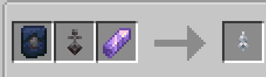
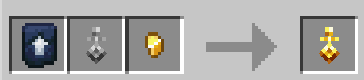
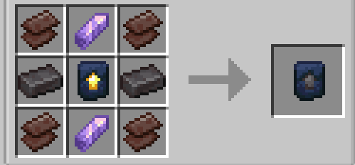

## What keys are there?

* Classic
* Netherrite
* Gold
* Iron

## What do they do?

Evrything after iron unlocks snapping if you have enough loyalty for it,each rank of key increases its range aside iron which dosent have the ability to snap.

## How do i get the keys?

* Classic key

* Gold key 

* Iron key

* Netherrite key

## How do I get those awesome key trims?

* Iron trim

* Netherrite trim

* Gold trim

