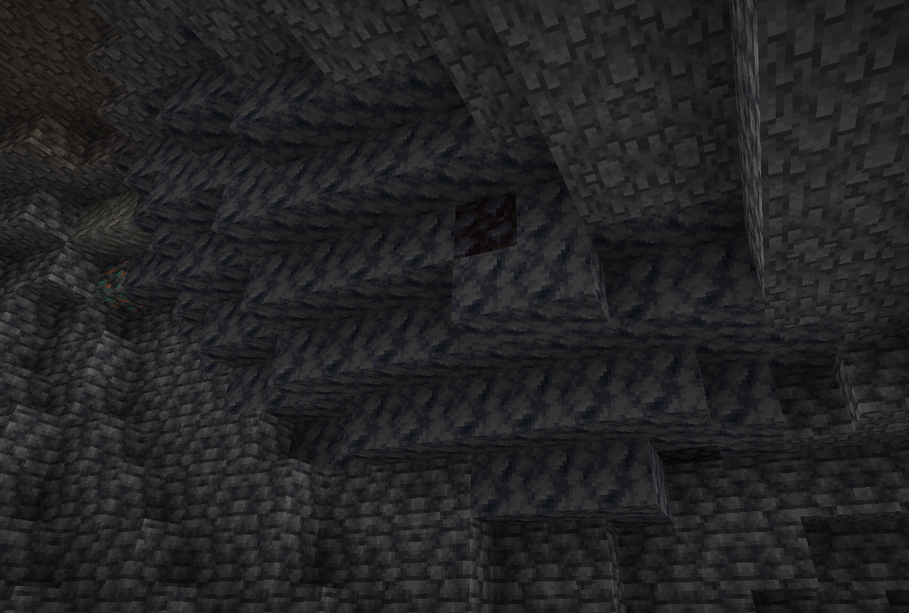
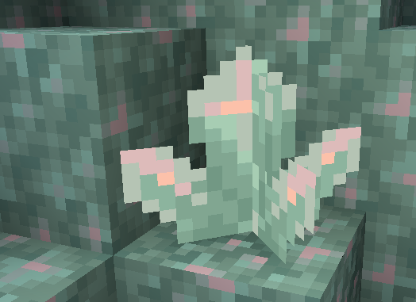
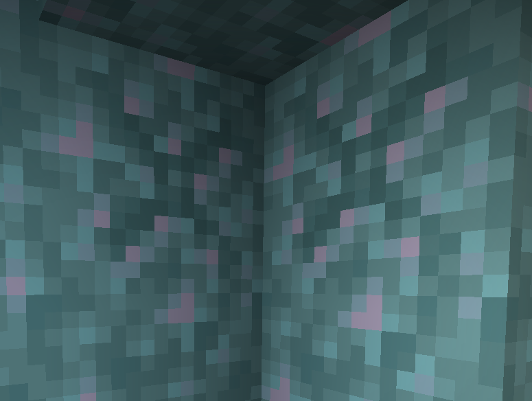
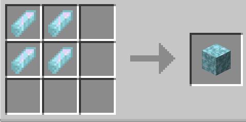

## What is zeiton?

Zeiton is the main new type of material this mod adds.
Theres the following variations
* Zeiton dust
* Zeiton block
* Zeiton budding
* All the types of zeiton growth
* Charged zeiton crystal

## How do i find it?
Like how amethyst geodes are found,in caves!

## What do i use zeiton for?

1. Zeiton is apart of the crafting recepie for the tardis coral
2. Used for the sonic screwdriver
3. Used to get charged zeiton a alternate to the nether star for reconfiguring your coral
4. Zeiton dust

## How do i get the big zeiton crystal?
You need silk touch for the big one

## Can i grow zeiton?
Yeah,zeiton budding has the capability of growing zeiton very slowly!

Though you'll have to find a zeiton geoode to acctualy get budding zeiton.

## Can i craft zeiton blocks?

## What about budding?

Sadly no.
